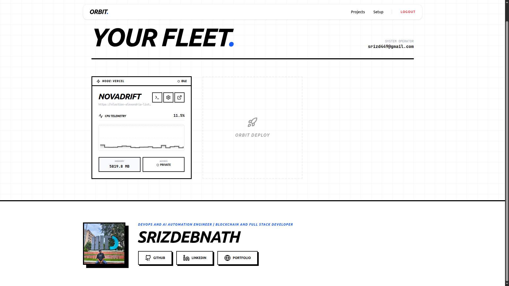

<p align="center">
  
</p>

<h1 align="center">🛰️ Orbit - The Neo-Brutalist Mini-PaaS</h1>

<p align="center">
  <strong>One CLI. One Dashboard. Ship Anywhere.</strong><br/>
  Deploy to Vercel, Netlify, your own VPS, or host from your laptop - with live telemetry streaming to a real-time dashboard.
</p>

<p align="center">
  <a href="https://www.npmjs.com/package/@srizdebnath/orbit"></a>
  
  
  
  
</p>

---

## ✨ Features

| Feature | Description |
|---|---|
| **Multi-Platform Deploy** | Ship to **Vercel**, **Netlify**, **Self-Host (VPS via Docker + Caddy)**, or **Laptop Hosting** via Cloudflare Tunnel. |
| **Auto Platform Login** | If you're not logged in to Vercel/Netlify, the CLI launches the login flow inline — no separate step needed. |
| **Live Telemetry** | Real-time **CPU & RAM** metrics streamed every 3 seconds to the dashboard via Supabase Realtime. |
| **Detailed Build Logs** | Full stdout + stderr from build and deploy piped live into the dashboard's xterm.js terminal — including failures. |
| **CLI Auth Handshake** | Secure 6-digit code flow: generate in terminal → approve in browser via GitHub OAuth. 2-minute timeout. |
| **VPS Deployment Engine** | Uploads project via tar/SCP, builds Docker image on the VPS, starts the container, configures Caddy reverse proxy. |
| **Neo-Brutalist UI** | Bold, high-contrast dashboard with grid backgrounds, hard shadows, and monospace typography. |
| **Team Collaboration** | Invite team members by email, remove members, and manage access from the Settings page. |
| **Deployment History** | Browse all past deployments per project with full log replay — including failed deploys. |

---

## 🏗️ Architecture

```
orbit/
├── apps/
│   └── dashboard/              # Next.js 16 Web Dashboard (The Control Plane)
│       ├── src/app/            # App Router pages
│       │   ├── page.tsx        #   Home — project fleet + GitHub login + footer
│       │   ├── setup/          #   Onboarding — CLI install steps
│       │   ├── auth/cli/       #   CLI handshake approval
│       │   └── projects/[id]/  #   Project overview, logs, settings
│       ├── src/components/     # Reusable UI
│       │   ├── Navbar.tsx      #   Top nav — auth state, logout
│       │   ├── ProjectCard.tsx #   Project card — status, metrics, links
│       │   ├── MetricChart.tsx #   Recharts live CPU area chart
│       │   ├── MetricDisplay.tsx#  Single live metric (CPU% / RAM MB)
│       │   └── TerminalView.tsx#   xterm.js log renderer
│       └── src/lib/
│           └── supabase.ts     # Shared Supabase singleton + TypeScript interfaces
│
├── packages/
│   └── cli/                    # TypeScript CLI — @srizdebnath/orbit on npm
│       └── src/
│           ├── index.ts        # Main entry — login, logout, status, rollback, deploy
│           ├── config.ts       # Supabase URL, anon key, dashboard URL (bundled)
│           └── engine.ts       # VPS engine — SSH → tar upload → Docker build → Caddy
│
├── .gitignore
└── README.md                   # ← You are here
```

---

## 🛠️ Tech Stack

| Layer | Technologies |
|---|---|
| **Frontend** | Next.js 16 (App Router), React 19, Tailwind CSS 4, Lucide Icons, Recharts, xterm.js |
| **Backend / DB** | Supabase (Auth, PostgreSQL, Real-time WebSockets, Row-Level Security) |
| **CLI** | Node.js ESM, Commander, Inquirer, Execa, systeminformation, node-ssh, Cloudflared |
| **Deploy Targets** | Vercel, Netlify, Docker + Caddy (VPS), Cloudflare Tunnel (Laptop) |

---

## 🚀 Quick Start

### Prerequisites

- **Node.js** ≥ 18, **npm** ≥ 9
- A free [Supabase](https://supabase.com) account
- *(Optional)* [Cloudflared](https://developers.cloudflare.com/cloudflare-one/connections/connect-networks/downloads/) for Laptop Hosting
- *(Optional)* Vercel CLI / Netlify CLI (the CLI auto-prompts login if needed)

### 1. Clone & Install

```bash
git clone https://github.com/Srizdebnath/Orbit-1.0.git
cd orbit

# Dashboard
cd apps/dashboard && npm install

# CLI
cd ../../packages/cli && npm install
```

### 2. Setup Supabase

See [`apps/dashboard/README.md`](apps/dashboard/README.md) for full SQL setup, Realtime config, and GitHub OAuth setup.

### 3. Run the Dashboard

```bash
cd apps/dashboard
cp .env.example .env.local   # Add your Supabase credentials
npm run dev                  # → http://localhost:3000
```

### 4. Build & Link the CLI

```bash
cd packages/cli
npm run build && npm link
```

### 5. Deploy

```bash
cd your-project
orbit login        # Authenticate via GitHub
orbit deploy       # Choose platform → build → deploy → done 🚀
```

---

## 📦 Install from npm

```bash
npm install -g @srizdebnath/orbit
```

---

## 🔧 CLI Commands

| Command | Description |
|---|---|
| `orbit login` | Authenticate via 6-digit code + GitHub OAuth (2-min timeout) |
| `orbit logout` | Remove local session (`~/.orbit_session.json`) |
| `orbit status` | View the status of all your projects — platform, URL, deploy count, last deploy time |
| `orbit rollback` | Rollback a project to a previous deployment — interactive history picker |
| `orbit env` | Manage environment variables per project — set, list, rm, pull |
| `orbit logs` | View deployment logs — use `-f` to follow live |
| `orbit token` | Manage API keys for CI/CD — create, list, revoke |
| `orbit domains` | Manage custom domains — add, list, rm, with SSL tracking |
| `orbit deploy` | Interactive deploy — pick platform, build, push, stream logs |
| `orbit --version` | Print current version |

### Deploy Platforms

| Platform | What Happens |
|---|---|
| **▲ Vercel** | Checks auth → auto-login if needed → `npm run build` → `npx vercel --yes --prod` |
| **◆ Netlify** | Checks auth → auto-login if needed → `npm run build` → auto-detects output dir → `npx netlify deploy --prod` |
| **⚡ Tunnel** | Checks `cloudflared` → checks port reachable → bridges `localhost:PORT` → public URL |
| **🖥 VPS** | Collects SSH config → tests connection → `npm run build` → tar upload → Docker build → Caddy config |

---

## 📂 Environment Variables

### Dashboard (`apps/dashboard/.env.local`)

| Variable | Description |
|---|---|
| `NEXT_PUBLIC_SUPABASE_URL` | Your Supabase project URL |
| `NEXT_PUBLIC_SUPABASE_ANON_KEY` | Your Supabase anonymous (public) key |

### CLI (`packages/cli/src/config.ts`)

The CLI bundles the production Supabase anon key. If self-hosting, update `config.ts`:

| Constant | Description |
|---|---|
| `ORBIT_URL` | URL of your Orbit Dashboard |
| `SUPABASE_URL` | Your Supabase project URL |
| `SUPABASE_ANON_KEY` | Your Supabase anonymous key |

---

## 🗺️ Roadmap

- [x] `orbit status` — Check deployment status from terminal
- [x] `orbit rollback` — Revert to a previous deployment
- [x] Dark mode
- [x] `orbit logs` — Stream live logs from terminal with `-f` follow mode
- [x] `orbit env` — Manage environment variables per project
- [x] `orbit token` — API key auth for CI/CD pipelines
- [x] `orbit domains` — Custom domain support per project
- [ ] Multi-user organizations & role-based access
- [ ] GitHub Actions CI/CD integration
- [ ] Webhook notifications (Slack / Discord)
- [ ] Docker Compose for local self-hosting
- [ ] Build caching & incremental deploys
- [ ] Usage analytics & billing dashboard

---

## 🤝 Contributing

1. Fork the repo
2. Create your branch (`git checkout -b feat/my-feature`)
3. Commit (`git commit -m 'feat: add my feature'`)
4. Push (`git push origin feat/my-feature`)
5. Open a Pull Request

---


## 👨‍💻 Author

**Srizdebnath** — [GitHub](https://github.com/Srizdebnath) · [LinkedIn](https://linkedin.com/in/srizdebnath) · [Portfolio](https://sriz.vercel.app)
